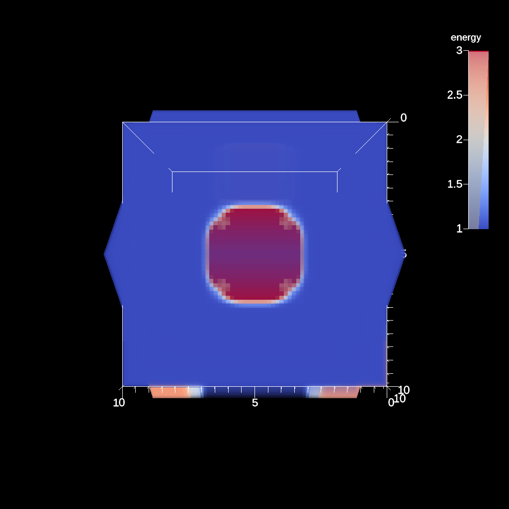

# Pantheon/E4S/Ascent in-situ miniapp example workflow

A repository for examples using Ascent, in-situ creation of `Cinema`
databases, and post-processing analysis. 

This workflow will pull cached builds from a [E4S](https://e4s-project.github.io/) repository, if they exist
to speed up the build/install of requisite applications. If no cached builds are available, it will use
[spack](https://github.com/spack/spack) to build applications.

<table>
<tr>
<td>
<td>
<td>
</tr>
</table>

Images from the resulting Cinema database

The workflow does the following:

1. Creates a Pantheon environment and build location
2. Clones a specific commit of `spack`
3. Uses `spack` to build `Ascent`, and set up a coupled app/in-situ workflow
4. Runs the workflow to produce a `Cinema` datbase
5. Verifies the `Cinema` database

The workflow incorporates the following ECP technogies:
1. [Pantheon](http://pantheonscience.org/)
1. [E4S](https://e4s-project.github.io/)
1. [Ascent](https://ascent.readthedocs.io/en/latest/)
1. [Cinema](https://cinemascience.org)
1. [Spack](https://github.com/spack/spack)

## Using this repository

First, clone the repository, then:

1. edit the `bootstrap.env` file to include your summit allocation ID
2. `.execute` will execute the workflow

When the workflow is run, the following files will be run in this order:

1. `setup/install-deps.sh`
    - `setup/install-app.sh` (called from the above script)
1. `run/run.sh` (this submits the job)
1. `run/wait_for_completion.sh`
1. `postprocessing/postprocessing.sh`
1. `validate/validate.sh`

## Edit these files
| file | what to do |
|------|---------|
|`bootstrap.env` | edit the `SUMMIT_ALLOCATION` variable value to reflect your allocation. |

## DO NOT edit these files

1. `pantheon/pantheon.env`
